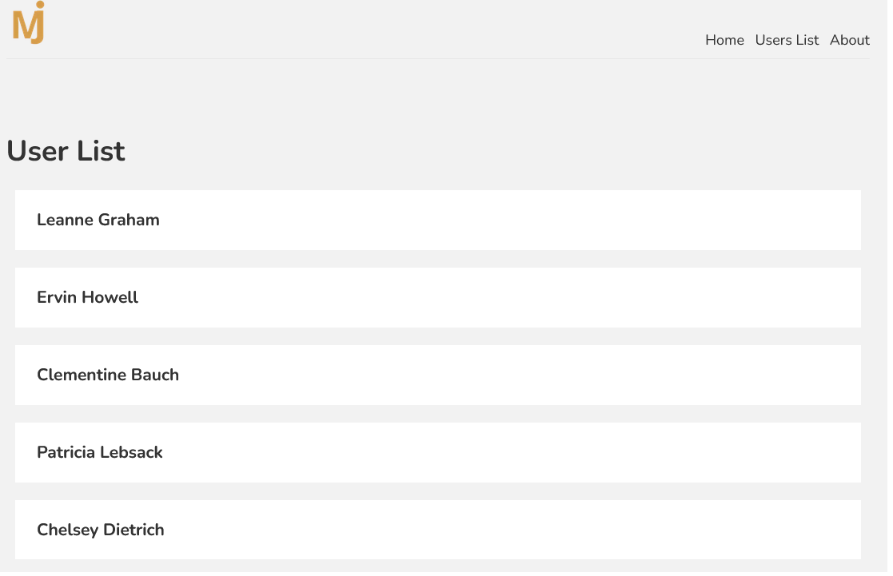

# User List - Nextjs Project

This is a basic practical [Next.js](https://nextjs.org/) project bootstrapped with [`create-next-app`](https://github.com/vercel/next.js/tree/canary/packages/create-next-app). It fetches the data from [JsonPlaceholder](https://jsonplaceholder.typicode.com/) as well.

See the live project [here](https://maxjn-userlist-next.vercel.app/) .

## Technologies

- JSX, Css
- ES6
- React
- **Nextjs**

## Features

- Mobile First
- Responsive

## Installation

Install **Userlist** with npm

```shell
npm install

npm run dev
```

## Screenshots


